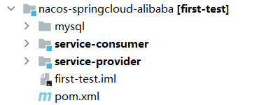

# Seata e2e测试项目

## 1. 项目结构

common：e2e框架本身，主要参考其他e2e框架进行编写。

e2e-data:  存放各e2e场景测试下所依赖的服务，数据。例如各个服务的DockFile文件，数据库初始化sql文件等。

e2e-test：存放各e2e场景测试的代码，docker-compose文件，依赖的配置文件。

## 2. e2e框架功能

e2e框架是一个帮助开发者进行e2e测试的框架，开发者只需要提供docker-compose文件即可通过juint进行容器启动并测试。开发者可通过注解指定容器启动，并获得容器的相关的信息。除此之外，框架还提供一些方便进行测试的功能，具体如下：

### 2.1 测试注解功能

##### 参考文档：

[junit5 文档](https://junit.org/junit5/docs/current/user-guide/#overview)

[JUnit 5.6.0 API](https://junit.org/junit5/docs/5.6.0/api/index.html)

**目前已经完成的功能**：

1. 自定义测试重试的次数。
2. 自定义每隔多少时间进行一次重试。
3. 自定义在出现什么错误时，捕获此错误并继续进行重试。如果没有指定错误，则出现任何错误都继续重试。

### 2.2 docker-compose文件相关功能

**参考文档**：

[testcontainers](https://www.testcontainers.org/quickstart/junit_5_quickstart/)
[testcontainers-API-doc](https://javadoc.io/doc/org.testcontainers/testcontainers/1.15.1/index.html)

**目前已经完成的功能**：

1. 读取docker-compose文件，并根据文件进行相应容器的启动，以及测试完成后容器的停止。
2. 根据开发者的期望，获取docker-compose中指定的容器的相关信息，例如容器在主机上能够访问的域名和端口，方便测试。
3. 每个容器运行时的日志存储在统一位置（默认/tmp/seata/logs），开发者可在相应目录下查看。

### 2.3 测试结果验证功能
**目前已经完成的功能：**

开发者可将期望的测试数据结果放在yaml文件中，通过框架读取此yaml文件后进行验证。框架提供一个抽象类（AbstractMatcher<T>，T为期望验证的数据所对应的类），此抽象类提供两个值之间的验证方法，包括大于，大于等于，等于，不等于，非空，正则表达式匹配验证。

其使用方法为在每个e2e测试场景下，需要一个类去继承此抽象类，然后重写里面的verfiy(T t)方法，编写具体的验证逻辑。这里的T是期望验证的数据所对应的类。也就是说，每个e2e测试场景下可设置专有的验证类来编写验证逻辑。

### 2.4 测试适配器
**目前已经完成的功能：**

提供一个抽象的适配器类（SeataTestAdapter），此类封装了一些测试常用的对象，开发者可继承此类然后自己编写在某个e2e测试场景中常用的方法以供测试使用。
抽象的适配器里面封装了常用的测试会用的对象：

1. DruidJdbcQuery，主要用于对数据库中的数据进行查询。
2. TrafficController，是一个定时任务执行控制器，按照指定的频率一直执行任务，直到主动取消。
3. TimesController，是一个固定次数任务执行控制器，按照指定的次数一直执行任务，直到次数执行完成。

## 3.测试场景

目前提供一个使用e2e框架的场景实例，业务场景中主要包括一个消费者，一个生产者，nacos，seata-server。业务逻辑为生产者调用消费者进行库存的消费，并查看消费是否成功。此业务场景下的测试主要为看加上@GlobalTransactional的存在错误的库存消费方法是否进行回滚。具体场景结构如下，可在e2e-data模块下进行查阅。

