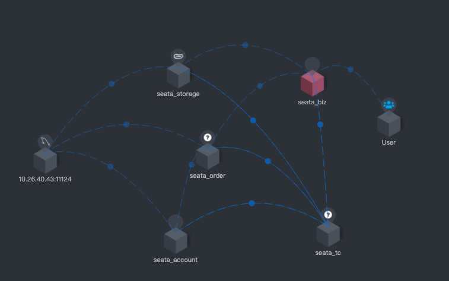
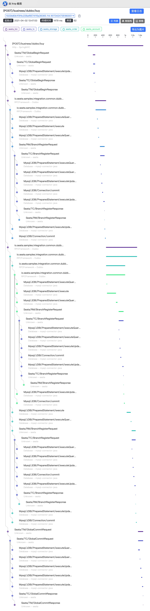
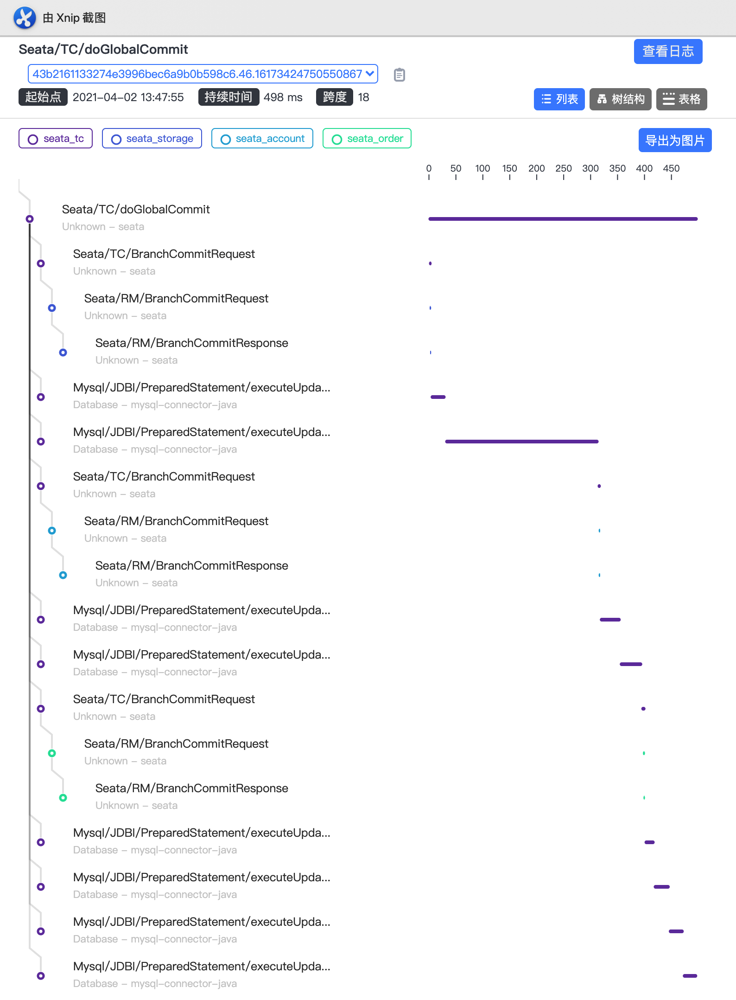

# Seata APM For SkyWalking

## What is Seata SkyWalking monitoring?

SkyWalking is APM. Currently, by adding Seata plug-in `apm-seata-skywalking-plugin-*.jar` to SkyWalking plug-in folder, SkyWalking can monitor the performance of Seata. The example is as follows:

### Topo

### Global Trace

## How to use?

1. In the root directory of Seata, by using the command `mvn clean package`, Seata's SkyWalking plug-in `seata/ext/apm-seata-skywalking-plugin/target/apm-seata-skywalking-plugin-*.jar` will be typed in the following location by using the command `mvn clean package` `
2. Put the plug-in into the SkyWalking plug-in package to complete.

## Attention

1. So far, monitoring only supports Seata non-packaged mode, So Seata client need config `  enableClientBatchSendRequest = false`
2. Seata server needs to increase environment variables `-Dskywalking.plugin.seata.server=true` 

