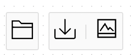
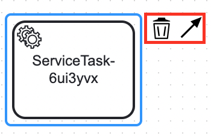
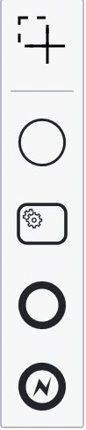
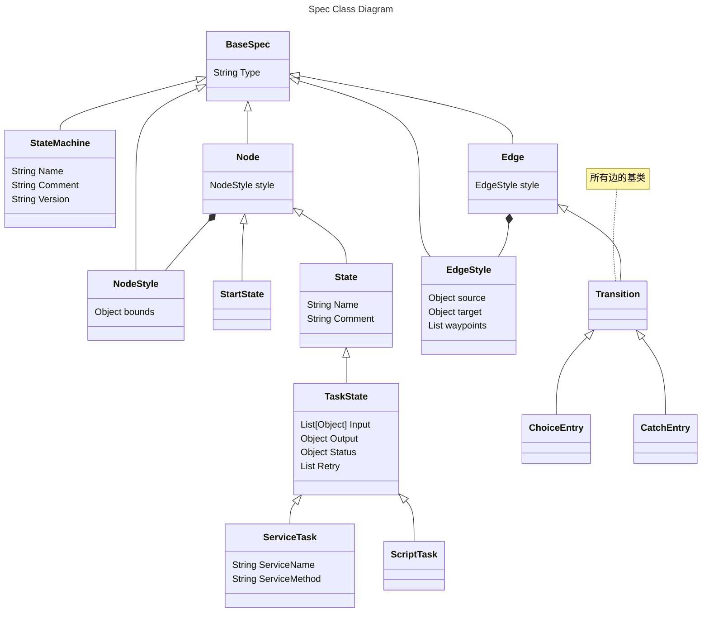
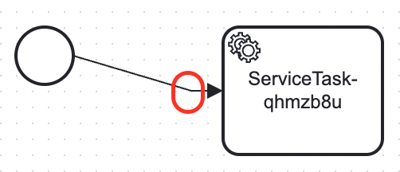
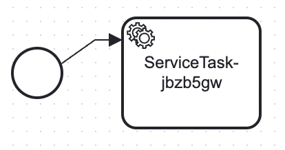
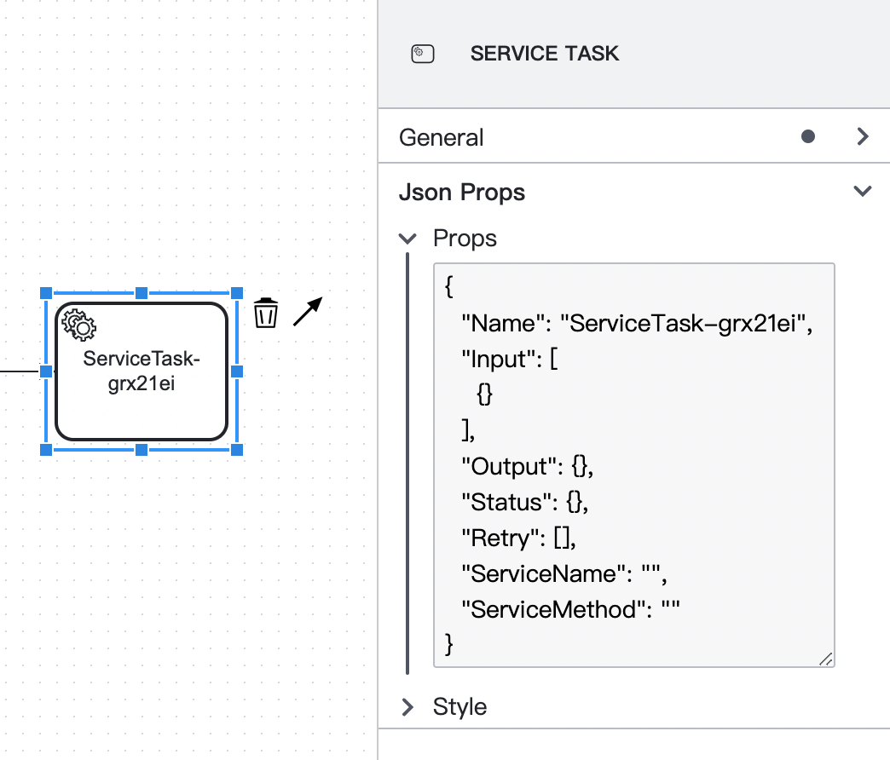
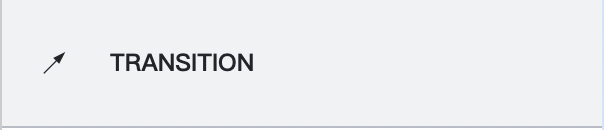
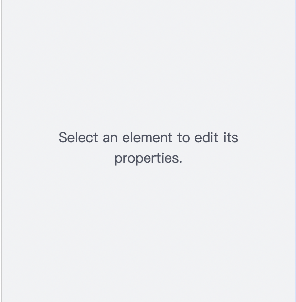
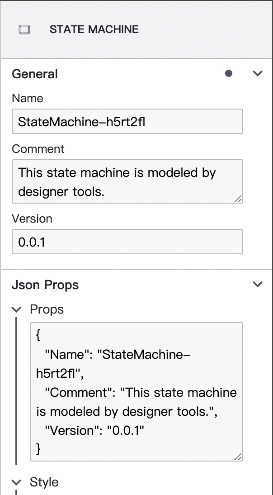

# Seata Saga state machine designer

由于旧版 Saga 状态机设计器的基座框架 ggeditor 不再维护，且 ggeditor 暴露出来的漏洞较多，影响了项目整体安全性。所以我们采取重构状态机设计器的做法，并使用新框架 diagram-js 为基座构建新的设计器。本文档涵盖 diagram-js 框架使用指南、设计器实现思路、代码结构等方面，旨在提供一个文档方便社区协作。


[TOC]


## diagram-js

[diagram-js](https://github.com/bpmn-io/diagram-js) 是 bpmn.io 组织开发维护的一款用于在网页上显示和修改流程图的框架。它使我们能够渲染视觉元素并在它们之上构建交互式体验。它为我们提供了一个非常简单的模块系统，用于构建服务发现的功能和依赖注入。该系统还提供了许多实现流程图要点的核心服务。此外 diagram-js 还定义了图形元素及其关系的数据模型。

基于 diagram-js 构建的知名项目有 bpmn-js, dmn-js 等等。在实现 Saga 状态机设计器时参考了很多 [bpmn-js](https://github.com/bpmn-io/bpmn-js) 的实现，一方面 Seata Saga 和 BPMN 规范有很多相似之处，且借鉴了很多 BPMN 的元素；另一方面，bpmn-js 就是基于 diagram-js 实现的，为 Saga 设计器的实现提供了一个模板。

下面我将总结一些 diagram-js 的整体架构，带大家快速入门。

### Diagram

`Diagram` 是 diagram-js 提供的核心类入口，如果想要在页面的 canvas 块中挂载一个图，可以使用以下代码

```js
const editor = new Diagram({
  container: document.querySelector('#canvas'),
  keyboard: { bindTo: document },
});
```

### 挂钩到生命周期

diagram-js 内部使用事件驱动架构，允许我们通过事件总线连接到 `Diagram` 的生命周期以及交互。以下代码展示了如何捕获一般变化的元素和建模操作，

```js
diagram.get('eventBus').on('commandStack.changed', () => {
  // user modeled something or
  // performed an undo/redo operation
});

modeler.on('element.changed', (event) => {
  const element = event.element;

  // the element was changed by the user
});
```

### 模块系统

要向 `Diagram` 注册扩展可以将它们作为数组传递给构造函数的 `modules` 选项中，这将允许传递修改或替换现有功能的自定义模块。

```js
const diagram = new Diagram({
  container: document.querySelector('#canvas'),
  keyboard: { bindTo: document },
  modules: [
    PropertiesPanel,
    PropertiesProvider,
  ],
});
```

而模块在 diagram-js 中是是定义一个或多个命名服务的单元。这些服务提供附加功能，通过挂钩到 diagram 的生命周期来实现。在底层，diagram-js使用依赖注入 (DI) 来连接和发现图表组件。这个机制是建立在 [didi ](https://github.com/nikku/didi) 之上的。下面显示了一个 [挂钩到生命周期](#挂钩到生命周期) 而实现的服务。

```js
const MyLoggingPlugin = (eventBus) => {
  eventBus.on('element.changed', (event) => {
    console.log('element ', event.element, ' changed');
  });
}

// ensure the dependency names are still available after minification
MyLoggingPlugin.$inject = [ 'eventBus' ];
```

我们必须使用模块定义以唯一的名称发布服务：

```js
import CoreModule from 'diagram-js/lib/core';

// export as module
export default {
  __depends__: [ CoreModule ], // {2}
  __init__: [ 'myLoggingPlugin' ], // {3}
  myLoggingPlugin: [ 'type', MyLoggingPlugin ] // {1}
};
```

该定义告诉 DI 基础设施该服务叫做`myLoggingPlugin` `{1}`，它依赖于 diagram-js 核心模块 `{2}`，并且该服务应在创建图表时初始化 `{3}`。有关更多详细信息，请查看 [didi 文档](https://github.com/nikku/didi/blob/master/README.md)。

现在可以基于创建出的模块传递到 `Diagram` 当中，

```js
import MyLoggingModule from 'path-to-my-logging-module';

const diagram = new Diagram({
  modules: [
    MyLoggingModule
  ]
});
```

### 核心服务

[diagram-js 核心](https://github.com/bpmn-io/diagram-js/tree/master/lib/core)是围绕许多基础服务构建的：

- [`Canvas`](https://github.com/bpmn-io/diagram-js/blob/master/lib/core/Canvas.js)- 提供用于添加和删除图形元素的API；处理元素生命周期并提供 API 来缩放和滚动。
- [`EventBus`](https://github.com/bpmn-io/diagram-js/blob/master/lib/core/EventBus.js)- 全局沟通渠道，采用 *fire and forget* 政策。感兴趣的各方可以订阅各种事件，并在事件发出后对其采取行动。事件总线帮助我们解耦关注点并模块化功能，以便新功能可以轻松地与现有行为挂钩。
- [`ElementFactory`](https://github.com/bpmn-io/diagram-js/blob/master/lib/core/ElementFactory.js)- 根据 diagram-js 的内部数据模型创建形状和连接的工厂。
- [`ElementRegistry`](https://github.com/bpmn-io/diagram-js/blob/master/lib/core/ElementRegistry.js)- 管理添加到图中的所有元素，并提供 API 来通过 id 检索元素及其图形表示。

### 数据模型

在底层，diagram-js 实现了一个由 `Shape` 和 `Connection` 组成的简单数据模型。`Shape` 具有父级、子级列表以及传入和传出 `Connections` 的列表。一个 `Connection` 有一个父级以及一个源和目标，分别指向一个 `Shape`。

[`ElementRegistry`](https://github.com/bpmn-io/diagram-js/blob/master/lib/core/ElementRegistry.js) 负责根据 [模型](https://github.com/bpmn-io/diagram-js/blob/master/lib/model/index.js) 创建 `Shape` 和 `Connection`。在建模过程中，[Modeling](https://github.com/bpmn-io/diagram-js/blob/master/lib/features/modeling/Modeling.js) 服务会根据用户操作更新元素关系。

### 辅助服务（工具箱）

除了数据模型及其核心服务之外，diagram-js 还提供了丰富的附加帮助工具箱。

- [`CommandStack`](https://github.com/bpmn-io/diagram-js/blob/master/lib/command/CommandStack.js)- 负责建模期间的重做和撤消。
- [`ContextPad`](https://github.com/bpmn-io/diagram-js/blob/master/lib/features/context-pad/ContextPad.js)- 提供围绕元素的上下文操作。
- [`Overlays`](https://github.com/bpmn-io/diagram-js/blob/master/lib/features/overlays/Overlays.js)- 提供用于将附加信息附加到图表元素的 API。
- [`Modeling`](https://github.com/bpmn-io/diagram-js/blob/master/lib/features/modeling/Modeling.js)- 提供用于更新画布上的元素（移动、删除）的 API
- [`Palette`](https://github.com/bpmn-io/diagram-js/blob/master/lib/features/palette/Palette.js)
- ...


## Saga 设计器深入解析


### 代码入口

#### Editor.js

在本文件中定义了名为 `Editor` 的类，继承自 diagram-js 的 `Diagram` 类。

首先定义 `Editor` 需要的模块，这里的模块指的是前文介绍的[模块系统](#模块系统)中的概念。`Editor` 的模块可以分为两类：定制化模块，和 diagram-js 内置模块。

```js
Editor.prototype.modules = [
  // Customized modules
  Layout,
  Modeling,
  Providers,
  Render,

  // Built-in modules
  AlignElementsModule,
  AutoScrollModule,
  BendpointsModule,
  // ...
];
```

值得注意的是 `Editor` 的两个方法，

**`Editor#import`**

用于从 JSON 定义的状态机导入进 `Editor` 中，内部逻辑是先清楚图中当前所有元素，然后调用 `sagaImporter` 模块的 `import` 方法，其中 `sagaImporter` 是定制化模块 `Modeling` 中的子模块，后续会进行介绍。

```js
Editor.prototype.import = function (definitions) {
  this.clear();
  this.get('sagaImporter')
    .import(definitions);
};
```

**`Editor#export`**

用于将 `Editor` 当前图中元素导出为 JSON 文件，调用 `sagaExporter` 模块的 `export` 方法，其中 `sagaExporter` 是定制化模块 `Modeling` 中的子模块，后续会进行介绍。

```js
Editor.prototype.export = function () {
  return this.get('sagaExporter')
    .export();
};
```

除此之外，`Editor` 还提供了一系列的实用方法以供调用，比如 `clear` 清除图中所有元素， `detach` 从容器中卸载等等。


#### index.js

新建 `Editor` 对象，挂载到 `canvas` block 中

```js
const editor = new Editor({
  container: document.querySelector('#canvas'),
  keyboard: { bindTo: document },
  propertiesPanel: { parent: '#properties' },
  // Add properties panel as additional modules
  additionalModules: [
    PropertiesPanel,
    PropertiesProvider,
  ],
});
```

值得注意的是，这里将 `PropertiesPanel`, `PropertiesProvider` 作为附加模块添加到 `Editor` 中而不是在 `Editor.prototype.modules` 中直接加入，是基于属性面板是一个可插拔模块的考虑。如果后续打算把设计器作为一个 npm 包进行发布，用户使用 `Editor` 时不需要捆绑属性面板使用。


在创建 `Editor` 对象之后，通过以下这行代码，

```js
control(editor);
```

是用于在画布上创建控制按钮，分别用于控制 `Editor` 进行导入、导出文件



### providers

providers 文件夹用于为 diagram-js 工具箱（见[辅助服务（工具箱）](#辅助服务（工具箱）)章节）提供对应条目的。

#### providers/ContextPadProvider.js



ContextPad 是 diagram-js 内置的辅助模块，可以定义 Provider 为其填充条目。实现的核心在于 `ContextPadProvider.prototype.getContextPadEntries` 方法，当前设计器针对于 Shape 会提供连接和删除两个条目，对于边则仅提供删除条目（边上再连边显然不合理）。


#### providers/PaletteProvider.js



Palette 是 diagram-js 内置的左侧画板，实现的核心在于 `PaletteProvider.prototype.getPaletteEntries` 方法，这里目前只实现了（ServiceTask, Fail, Success 三种类型状态，还有一个开始节点，状态仍需扩充）除了各种状态之外，在最上方还提供了拉索工具，用于批量框选状态从而进行删除或移动等操作。


### spec

spec 文件夹中内聚了所有状态的定义，主要作用是规定了每个状态新建时的默认属性，且通过 `importJson` 和 `exportJson` 定义了一些导入导出的转换逻辑。这里的代码文件不再展开介绍，可以通过比对代码和下方的类图进行理解。



根据上图，可以了解 Spec 相关类图，和 Saga Java 代码中定义有类似之处。与 Java 代码不同的是，由于设计器需要将状态机以图的形式呈现给用户，所以状态、连接都需要通过 `style` 属性进行记录。


### modeling

Modeling 模块是 Saga 状态机设计器的逻辑核心，这个模块逻辑内聚了 Saga 规范。每个文件都很重要，下文将针对每个代码文件分别展开进行描述。


#### modeling/Modeling.js

`Modeling` 继承 diagram-js 的 `BaseModeling`，本文件主要定义了

1. 创建连接时基于 `rules` 模块判断是否可以连接

   ```js
   if (!attrs) {
     attrs = rules.canConnect(source, target);
   }
   
   return this.createConnection(source, target, attrs, rootElement, hints);
   ```

2. 定义实用方法 `Modeling#updateProperties`，用于更新元素属性，实现了属性更新和撤回的逻辑，分别位于 `UpdatePropertiesHandler#execute` 和 `UpdatePropertiesHandler#revert` 中。


#### modeling/SagaFactory.js

`SagaFacotry` 作为 Saga 规范的工厂类，其主要的方法是

```js
SagaFactory.prototype.create = function (type) {
  const Spec = this.typeToSpec.get(type);
  return new Spec();
};
```

传入字符串类型的元素类型，`SagaFactory` 获取类型对应的 `Spec` 并创建新对象进行返回。关于 `Spec` 请参考前文 [spec](#spec) 章节。


#### modeling/ElementFacotry.js

`ElementFactory` 本身是 diagram-js 提供的核心模块之一，这里我们使用继承的方式对其进行扩展。主要重载了 `ElementFactory#create` 方法，使用 `SagaFactory` 创建业务对象保存在元素的 `businessObject` 字段中

```js
ElementFactory.prototype.create = function (elementType, attrs) {
  const { sagaFactory } = this;

  attrs = attrs || {};

  let { businessObject } = attrs;

  if (!businessObject) {
    if (!attrs.type) {
      throw new Error('no shape type specified');
    }

    businessObject = sagaFactory.create(attrs.type);
  }

  const size = sagaFactory.getDefaultSize(businessObject);

  attrs = assign({ businessObject }, size, attrs);

  return this.baseCreate(elementType, attrs);
};
```


#### modeling/SagaRules.js

`SagaRules` 继承了 diagram-js 的 `RuleProvider` 类，旨在提供绘图的验证规则。比如说在 Saga 状态机中，一条边不能连向自身状态（否则会造成产生死循环），这里我们通过 `SagaRules#canConnect` 方法进行实现。


#### modeling/SagaImporter.js

`SagaImporter` 的功能单一，聚焦于将 JSON 状态机定义导入到设计器中，核心的代码实现在于 `SagaImporter#import` 方法中，代码逻辑也不复杂，

```js
try {
  const root = this.sagaFactory.create('StateMachine');
  root.importJson(definitions);
  this.root(root);

  // Add start state
  const start = this.sagaFactory.create('StartState');
  start.importJson(definitions);
  this.add(start);

  const edges = [];
  forEach(definitions.States, (semantic) => {
    const state = this.sagaFactory.create(semantic.Type);
    state.importJson(semantic);
    this.add(state);
    if (semantic.edge) {
      edges.push(...Object.values(semantic.edge));
    }
  });

  // Add start edge
  if (definitions.edge) {
    const startEdge = this.sagaFactory.create('Transition');
    startEdge.importJson(definitions.edge);
    this.add(startEdge, { source: start });
  }

  forEach(edges, (semantic) => {
    const transition = this.sagaFactory.create(semantic.Type);
    transition.importJson(semantic);
    this.add(transition);
  });
```

首先根据状态机 StateMachine 自身定义创建根元素，然后再基于 StateMachine 的 style 属性创建出一个起始元素“伪状态”，随后遍历 `States` 字段，创建出每个状态并收集边集 `edges` 。对于边的创建，需要从“伪状态”加一条边到 `StartState`，此后再根据 `edges` 依次创建即可。


#### modeling/SagaExporter.js

`SagaExporter` 和 `SagaImporter` 的功能相反，是根据绘图导出为 JSON 文件定义。这里需要注意的是 `SagaExporter` 和 `SagaImporter` 的实现上可以相互对照，基本上互为彼此的逆操作。


### render

render 模块，顾名思义就是渲染的核心模块，负责将状态机以 SVG 矢量图的形式呈现给用户。


#### render/Renderer.js

`Renderer` 是所有元素的绘图入口，对于不同的元素类型我们使用 `handlers` 变量中定义的不同处理器进行绘图，

```js
Transition(p, element) {
  const fill = getFillColor(element, defaultFillColor);
  const stroke = getStrokeColor(element, defaultStrokeColor);
  const attrs = {
    stroke,
    strokeWidth: 1,
    strokeLinecap: 'round',
    strokeLinejoin: 'round',
    markerEnd: marker('connection-end', fill, stroke),
  };

  return drawLine(p, element.waypoints, attrs);
},
```


#### render/TextRenderer.js

为渲染文字单独抽象出来的实用类，后续应该不需要改动。


#### render/PathMap.js

核心定义了一个 `pathMap` 用于记录不同的绘图元素的 SVG 路径，比如

```js
this.pathMap = {
  TASK_TYPE_SERVICE: {
    d: 'm {mx},{my} v -1.71335 c 0.352326,-0.0705 0.703932,-0.17838 1.047628,-0.32133 '
      + '0.344416,-0.14465 0.665822,-0.32133 0.966377,-0.52145 l 1.19431,1.18005 1.567487,-1.57688 '
      + '-1.195028,-1.18014 c 0.403376,-0.61394 0.683079,-1.29908 0.825447,-2.01824 l 1.622133,-0.01 '
      + 'v -2.2196 l -1.636514,0.01 c -0.07333,-0.35153 -0.178319,-0.70024 -0.323564,-1.04372 '
      + '-0.145244,-0.34406 -0.321407,-0.6644 -0.522735,-0.96217 l 1.131035,-1.13631 -1.583305,-1.56293 '
      + '-1.129598,1.13589 c -0.614052,-0.40108 -1.302883,-0.68093 -2.022633,-0.82247 l 0.0093,-1.61852 '
      + 'h -2.241173 l 0.0042,1.63124 c -0.353763,0.0736 -0.705369,0.17977 -1.049785,0.32371 -0.344415,0.14437 '
      + '-0.665102,0.32092 -0.9635006,0.52046 l -1.1698628,-1.15823 -1.5667691,1.5792 1.1684265,1.15669 '
      + 'c -0.4026573,0.61283 -0.68308,1.29797 -0.8247287,2.01713 l -1.6588041,0.003 v 2.22174 '
      + 'l 1.6724648,-0.006 c 0.073327,0.35077 0.1797598,0.70243 0.3242851,1.04472 0.1452428,0.34448 '
      + '0.3214064,0.6644 0.5227339,0.96066 l -1.1993431,1.19723 1.5840256,1.56011 1.1964668,-1.19348 '
      + 'c 0.6140517,0.40346 1.3028827,0.68232 2.0233517,0.82331 l 7.19e-4,1.69892 h 2.226848 z '
      + 'm 0.221462,-3.9957 c -1.788948,0.7502 -3.8576,-0.0928 -4.6097055,-1.87438 -0.7521065,-1.78321 '
      + '0.090598,-3.84627 1.8802645,-4.59604 1.78823,-0.74936 3.856881,0.0929 4.608987,1.87437 '
      + '0.752106,1.78165 -0.0906,3.84612 -1.879546,4.59605 z',
  },
  TASK_TYPE_SERVICE_FILL: {
    d: 'm {mx},{my} c -1.788948,0.7502 -3.8576,-0.0928 -4.6097055,-1.87438 -0.7521065,-1.78321 '
      + '0.090598,-3.84627 1.8802645,-4.59604 1.78823,-0.74936 3.856881,0.0929 4.608987,1.87437 '
      + '0.752106,1.78165 -0.0906,3.84612 -1.879546,4.59605 z',
  },
  MARKER_COMPENSATION: {
    d: 'm {mx},{my} 7,-5 0,10 z m 7.1,-0.3 6.9,-4.7 0,10 -6.9,-4.7 z',
    height: 10,
    width: 21,
    heightElements: [],
    widthElements: [],
  },
  MARKER_LOOP: {
    d: 'm {mx},{my} c 3.526979,0 6.386161,-2.829858 6.386161,-6.320661 0,-3.490806 -2.859182,-6.320661 '
      + '-6.386161,-6.320661 -3.526978,0 -6.38616,2.829855 -6.38616,6.320661 0,1.745402 '
      + '0.714797,3.325567 1.870463,4.469381 0.577834,0.571908 1.265885,1.034728 2.029916,1.35457 '
      + 'l -0.718163,-3.909793 m 0.718163,3.909793 -3.885211,0.802902',
    height: 13.9,
    width: 13.7,
    heightElements: [],
    widthElements: [],
  },
};
```

对于 Saga 状态机设计器而言，我们几乎所有的状态和元素绘图都可以参考 BPMN 规范的设计元素，所以可以直接参考使用 bpmn-js 的 [PathMap.js](https://github.com/bpmn-io/bpmn-js/blob/develop/lib/draw/PathMap.js) 文件即可。


### layout

Layout 模块专注于布局变化。


#### layout/Layouter.js

`Layouter` 继承自 diagram-js 的 `BaseLayouter` ，并在此基础上通过重载 `layoutConnection` 方法实现了连接线根据箭头朝向加入转折点的行为。




#### layout/behaviour/*.js

在 layout/behaviour 文件夹中定义了一系列的行为用于在布局变动（比如添加新元素、连接，或者对现有图重布局等等）时对布局进行自动调整、逻辑适配。

##### layout/behaviour/LayoutConnectionBehaviour.js

`LayoutConnectionBehaviour` 用于在布局变动时为边的连接点重新定位，如果不加入这个子模块，连接是这样的：



加入这个子模块之后，无论在创建、移动边的时候指向哪里，最终的边都会指向元素中部位置，使得布局更清晰：


这部分实现逻辑比较复杂和业务关系不大，主要实现在了 `LayoutConnectionBehaviour` 构造方法中，且附加上了代码注释。


##### layout/behaviour/ReplaceConnectionBehavior.js

`ReplaceConnectionBehaviour` 用于配合 [rules](#modeling/SagaRules.js) 模块实现当连接更改连接点（即 `source` 或者 `target` ）时验证是否可以进行连接，如可以再进行连接。


##### layout/behaviour/LayoutUpdateBehavior.js

`LayoutUpdateBehavior` 用于在布局发生变化时为业务对象 `businessObject` 进行逻辑适配。目前主要是用于在布局变动时更新 `businessObject.style` 属性。


### properties-panel

properties-panel 组件的开发基于 @bpmn-io/properties-panel 包，和 diagram-js 一样也是由 bpmn-io 组织开发，是一套属性面板基础组件。

属性面板目前类似于旧版设计器的实现，需要用户填写 JSON 来更新状态。



在 properties-panel 根目录下的几个代码文件主要用于定义属性面板的样式，后续不太需要维护，这里简单介绍一下。

- `PropertiesPanelRenderer` 为属性面板的根元素，用于在页面上渲染出一个属性面板来

- `PropertiesPanel` 基于 diagram-js `PropertiesPanel` 的组件重新定制的组件，功能包含了向事件总线上注册一系列处理器，比如 selection 变化时更改属性面板的目标元素等等。

- `PropertiesPanelContext` 是一个 React Context，用于提供了一个在组件树间进行数据传递的方法。

- `PanelHeaderProvider` 用于定义属性面板头部显示内容

  

- `PanelPlaceHolderProvider` 用于定义无元素选择时显示的内容

  

#### properties-panel/provider

properties-panel 模块定义了属性面板，properties-panel/provider 模块则定义了为状态提供怎样的属性编辑。



##### properties-panel/provider/PropertiesProvider.js

`PropertiesProvider` 该文件定义了针对不同的元素（状态或连接）应该展示怎样的属性编辑。

##### properties-panel/provider/properties

目前支持的属性编辑都可以在 properties-panel/provider/properties 文件夹下找到，General 组提供了 `Name`, `Comment`, `Version` 的支持，JSON Props 组提供了 JSON 属性的编辑和 `style` 样式的展示。

比如说想要调整 `Name` 属性的编辑逻辑，则应该到 properties-panel/provider/properties/NameProps.js 文件中进行更改。


## Build

项目基于 webpack 进行构建，构建文件 webpack.config.js 位于根目录下。使用 package.json 中定义的脚本可以完成构建、运行等操作。

```
npm install
```

Bundle the editor contained in `src` and output it to `dist`:

```
npm run build
```

Start the development setup, opening the app and rebuild on changes:

```
npm run start
```


