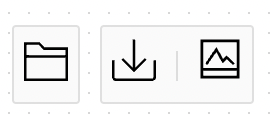
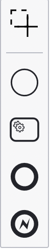
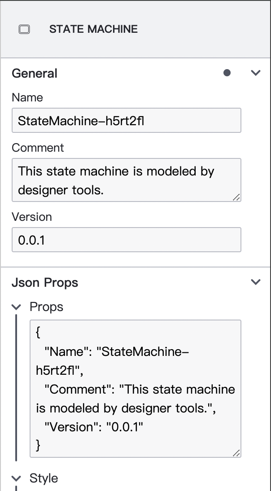

# Seata Saga State Machine Designer

Due to the discontinuation of maintenance for the old version of the Saga State Machine Designer's underlying framework, ggeditor, and the numerous vulnerabilities exposed by ggeditor, which affected the overall security of the project, we have chosen to refactor the State Machine Designer. We are using a new framework, diagram-js, as the foundation for building the new designer. This document covers aspects such as the usage guide for the diagram-js framework, the implementation approach of the designer, code structure, and more, aiming to provide a document that facilitates community collaboration.

[TOC]

## diagram-js

[diagram-js](https://github.com/bpmn-io/diagram-js) is a framework developed and maintained by the bpmn.io organization for displaying and modifying process diagrams on web pages. It allows us to render visual elements and build interactive experiences on top of them. It provides a simple module system for building functionality and dependency injection for service discovery. The system also offers many core services that implement key points of a process diagram. Additionally, diagram-js defines the data model for graphical elements and their relationships.

Well-known projects built on diagram-js include bpmn-js, dmn-js, and more. When implementing the Saga State Machine Designer, we referred to many implementations of [bpmn-js](https://github.com/bpmn-io/bpmn-js). On one hand, Seata Saga and BPMN specifications share many similarities, and we borrowed elements from BPMN. On the other hand, bpmn-js is implemented based on diagram-js, providing a template for implementing the Saga Designer.

Below, I will summarize the overall architecture of diagram-js to help you quickly get started.

### Diagram

`Diagram` is the core class provided by diagram-js. If you want to mount a diagram in a canvas block on a page, you can use the following code:

```js
const editor = new Diagram({
  container: document.querySelector('#canvas'),
  keyboard: { bindTo: document },
});
```

### Hook into Lifecycle

Diagram-js internally uses an event-driven architecture, allowing us to connect to the lifecycle and interactions of the `Diagram` through the event bus. The following code shows how to capture general changes to elements and modeling operations:

```js
diagram.get('eventBus').on('commandStack.changed', () => {
  // User modeled something or
  // performed an undo/redo operation
});

modeler.on('element.changed', (event) => {
  const element = event.element;

  // The element was changed by the user
});
```

### Module System

To register extensions with `Diagram`, you can pass them as an array to the `modules` option of the constructor. This allows custom modules to be passed that modify or replace existing functionality.

```js
const diagram = new Diagram({
  container: document.querySelector('#canvas'),
  keyboard: { bindTo: document },
  modules: [
    PropertiesPanel,
    PropertiesProvider,
  ],
});
```

Modules in diagram-js define units that provide one or more named services. These services offer additional functionality by hooking into the lifecycle of the diagram. Under the hood, diagram-js uses Dependency Injection (DI) for connecting and discovering chart components, built on top of [didi](https://github.com/nikku/didi). The following example demonstrates a service implemented by [hooking into the lifecycle](#hook-into-lifecycle).

```js
const MyLoggingPlugin = (eventBus) => {
  eventBus.on('element.changed', (event) => {
    console.log('element ', event.element, ' changed');
  });
}

// Ensure the dependency names are still available after minification
MyLoggingPlugin.$inject = [ 'eventBus' ];
```

We must use a module definition to publish services with unique names:

```js
import CoreModule from 'diagram-js/lib/core';

// Export as a module
export default {
  __depends__: [ CoreModule ], // {2}
  __init__: [ 'myLoggingPlugin' ], // {3}
  myLoggingPlugin: [ 'type', MyLoggingPlugin ] // {1}
};
```

This definition tells the DI infrastructure that the service is called `myLoggingPlugin` `{1}`, it depends on the diagram-js core module `{2}`, and the service should be initialized when the chart is created `{3}`. For more detailed information, refer to the [didi documentation](https://github.com/nikku/didi/blob/master/README.md).

Now you can pass the created module to `Diagram`:

```js
import MyLoggingModule from 'path-to-my-logging-module';

const diagram = new Diagram({
  modules: [
    MyLoggingModule
  ]
});
```

### Core Services

[diagram-js core](https://github.com/bpmn-io/diagram-js/tree/master/lib/core) is built around many fundamental services:

- [`Canvas`](https://github.com/bpmn-io/diagram-js/blob/master/lib/core/Canvas.js): Provides an API for adding and removing graphical elements; handles the lifecycle of elements and provides an API for zooming and scrolling.
- [`EventBus`](https://github.com/bpmn-io/diagram-js/blob/master/lib/core/EventBus.js): Global communication channel with a *fire and forget* policy. Interested parties can subscribe to various events and take action after the event is fired. The event bus helps decouple concerns and modularize functionality for easy integration of new features with existing behavior.
- [`ElementFactory`](https://github.com/bpmn-io/diagram-js/blob/master/lib/core/ElementFactory.js): Factory for creating shapes and connections based on the internal data model of diagram-js.
- [`ElementRegistry`](https://github.com/bpmn-io/diagram-js/blob/master/lib/core/ElementRegistry.js): Manages all elements added to the chart and provides an API to retrieve elements and their graphical representations by id.

### Data Model

At its core, diagram-js implements a simple data model consisting of `Shape` and `Connection`. `Shape` has a parent, a list of children, and lists of incoming and outgoing `Connections`. A `Connection` has a parent and source and target pointing to a `Shape`.

[`ElementRegistry`](https://github.com/bpmn-io/diagram-js/blob/master/lib/core/ElementRegistry.js) is responsible for creating `Shape` and `Connection` based on the [model](https://github.com/bpmn-io/diagram-js/blob/master/lib/model/index.js). During modeling, the [Modeling](https://github.com/bpmn-io/diagram-js/blob/master/lib/features/modeling/Modeling.js) service updates element relationships based on user actions.

### Auxiliary Services (Toolbox)

In addition to the data model and its core services, diagram-js also provides a rich set of additional auxiliary toolbox services:

- [`CommandStack`](https://github.com/bpmn-io/diagram-js/blob/master/lib/command/CommandStack.js): Responsible for redo and undo during modeling.
- [`ContextPad`](https://github.com/bpmn-io/diagram-js/blob/master/lib/features/context-pad/ContextPad.js): Provides context operations around elements.
- [`Overlays`](https://github.com/bpmn-io/diagram-js/blob/master/lib/features/overlays/Overlays.js): Provides an API for attaching additional information to chart elements.
- [`Modeling`](https://github.com/bpm

n-io/diagram-js/blob/master/lib/features/modeling/Modeling.js): Provides an API for updating elements on the canvas (moving, deleting).
- [`Palette`](https://github.com/bpmn-io/diagram-js/blob/master/lib/features/palette/Palette.js)
- ...

## In-Depth Analysis of Saga Designer

### Code Entry

#### Editor.js

In this file, a class named `Editor` is defined, which inherits from the `Diagram` class of diagram-js.

First, the required modules for `Editor` are defined. These modules can be categorized into two types: customized modules and built-in modules of diagram-js.

```js
Editor.prototype.modules = [
  // Customized modules
  Layout,
  Modeling,
  Providers,
  Render,

  // Built-in modules
  AlignElementsModule,
  AutoScrollModule,
  BendpointsModule,
  // ...
];
```

It's worth noting two methods of `Editor`:

**`Editor#import`**

Used to import a state machine defined in JSON into the `Editor`. The internal logic involves clearing all current elements in the diagram first and then calling the `import` method of the `sagaImporter` module. The `sagaImporter` is a submodule in the customized module `Modeling`, which will be introduced later.

```js
Editor.prototype.import = function (definitions) {
  this.clear();
  this.get('sagaImporter')
    .import(definitions);
};
```

**`Editor#export`**

Used to export the current elements in the `Editor` to a JSON file. It calls the `export` method of the `sagaExporter` module. The `sagaExporter` is also a submodule in the customized module `Modeling`, which will be introduced later.

```js
Editor.prototype.export = function () {
  return this.get('sagaExporter')
    .export();
};
```

In addition to these, `Editor` provides a series of utility methods for clearing all elements in the diagram (`clear`), detaching from the container (`detach`), and more.

#### index.js

Create a new `Editor` object and mount it to the `canvas` block.

```js
const editor = new Editor({
  container: document.querySelector('#canvas'),
  keyboard: { bindTo: document },
  propertiesPanel: { parent: '#properties' },
  // Add properties panel as additional modules
  additionalModules: [
    PropertiesPanel,
    PropertiesProvider,
  ],
});
```

It's worth noting that `PropertiesPanel` and `PropertiesProvider` are added as additional modules to `Editor` rather than directly in `Editor.prototype.modules`. This is done considering that the property panel is a pluggable module. If the designer is intended to be published as an npm package in the future, users can use `Editor` without bundling the property panel.

After creating the `Editor` object, the following code:

```js
control(editor);
```

is used to create control buttons on the canvas, allowing control over the import and export of files in the `Editor`.



### Providers

The providers folder is used to provide corresponding entries for the diagram-js toolbox (see the [Auxiliary Services (Toolbox)](#auxiliary-services-toolbox) section).

#### providers/ContextPadProvider.js


ContextPad is a built-in auxiliary module in diagram-js, and providers can be defined to populate entries for it. The core implementation is in the `ContextPadProvider.prototype.getContextPadEntries` method. In the current designer, entries for connecting and deleting are provided for shapes, while only the delete entry is provided for edges (connecting edges to edges is not logical).

#### providers/PaletteProvider.js



Palette is a built-in left-side panel in diagram-js. The core implementation is in the `PaletteProvider.prototype.getPaletteEntries` method. Currently, it only implements entries for various states (ServiceTask, Fail, Success, three types of states, and a start node; more state types may be added later). In addition to various states, a lasso tool is provided at the top for batch selection of states for operations such as deletion or movement.

### Spec

The spec folder contains all the definitions for states, mainly specifying the default attributes when creating each state. It also defines some conversion logic for import and export using `importJson` and `exportJson`. The code files here are not expanded for discussion, and understanding can be gained by comparing the code with the class diagram below.


According to the diagram above, you can understand the class diagram related to the Spec classes, which has similarities with the Saga Java code definitions. The difference from Java code is that, since the designer needs to present the state machine as a graph to the user, states and connections need to be recorded through the `style` attribute.

### Modeling Module Deep Dive

The `modeling` module is the core logic of the Saga state machine designer, and it tightly integrates with the Saga specification. Let's explore each code file in this module.

#### modeling/Modeling.js

This file defines the `Modeling` class, which extends diagram-js's `BaseModeling`. The main functionalities include:

1. Creating connections based on the `rules` module to determine if a connection is allowed.

   ```js
   if (!attrs) {
     attrs = rules.canConnect(source, target);
   }
   
   return this.createConnection(source, target, attrs, rootElement, hints);
   ```

2. Defining utility method `Modeling#updateProperties` for updating element properties. It implements the logic for property updates and undoing the updates, located in `UpdatePropertiesHandler#execute` and `UpdatePropertiesHandler#revert`, respectively.

#### modeling/SagaFactory.js

The `SagaFactory` acts as the factory class for Saga specifications. Its main method is:

```js
SagaFactory.prototype.create = function (type) {
  const Spec = this.typeToSpec.get(type);
  return new Spec();
};
```

Given a string representing the element type, the `SagaFactory` retrieves the corresponding `Spec` and creates a new object.

#### modeling/ElementFactory.js

`ElementFactory` is an extension of the core module provided by diagram-js. It overrides the `ElementFactory#create` method, using `SagaFactory` to create a business object and save it in the element's `businessObject` field.

```js
ElementFactory.prototype.create = function (elementType, attrs) {
  const { sagaFactory } = this;

  attrs = attrs || {};

  let { businessObject } = attrs;

  if (!businessObject) {
    if (!attrs.type) {
      throw new Error('no shape type specified');
    }

    businessObject = sagaFactory.create(attrs.type);
  }

  const size = sagaFactory.getDefaultSize(businessObject);

  attrs = assign({ businessObject }, size, attrs);

  return this.baseCreate(elementType, attrs);
};
```

#### modeling/SagaRules.js

`SagaRules` extends diagram-js's `RuleProvider` class and aims to provide validation rules for drawing. For instance, in Saga state machines, a transition cannot connect to the same state (as it would create a deadlock). This is implemented in the `SagaRules#canConnect` method.

#### modeling/SagaImporter.js

The `SagaImporter` focuses on importing JSON state machine definitions into the designer. The core logic is in the `SagaImporter#import` method. The code logic involves creating the root element, creating a pseudo-state element, iterating over the states, and creating edges.

#### modeling/SagaExporter.js

`SagaExporter` and `SagaImporter` are counterparts, where `SagaExporter` exports the current state machine into a JSON file. It's essential to note that their implementations can be compared as inverse operations of each other.

### render Module

The `render` module is responsible for the core rendering of the state machine in SVG format.

#### render/Renderer.js

The `Renderer` serves as the entry point for drawing all elements. For different element types, it uses handlers defined in the `handlers` variable for rendering.

```js
Transition(p, element) {
  const fill = getFillColor(element, defaultFillColor);
  const stroke = getStrokeColor(element, defaultStrokeColor);
  const attrs = {
    stroke,
    strokeWidth: 1,
    strokeLinecap: 'round',
    strokeLinejoin: 'round',
    markerEnd: marker('connection-end', fill, stroke),
  };

  return drawLine(p, element.waypoints, attrs);
},
```

#### render/TextRenderer.js

A utility class specifically abstracted for rendering text. It is not likely to require modifications in the future.

#### render/PathMap.js

This file defines a `pathMap` used to record SVG paths for different drawing elements. For the Saga state machine designer, almost all drawing elements can be referenced from the design elements in the BPMN specification. Therefore, you can directly use bpmn-js's [PathMap.js](https://github.com/bpmn-io/bpmn-js/blob/develop/lib/draw/PathMap.js) file.

### layout Module

The `layout` module focuses on layout changes.

#### layout/Layouter.js

`Layouter` extends diagram-js's `BaseLayouter` and, on top of that, implements the `layoutConnection` method to introduce bends in the connection lines based on the direction of the arrow.


#### layout/behaviour/*.js

In the `layout/behaviour` folder, a series of behaviors are defined to automatically adjust the layout and logic adaptation of the layout when layout changes occur (such as adding new elements, connections, or re-layouting the existing diagram).

##### layout/behaviour/LayoutConnectionBehaviour.js

`LayoutConnectionBehaviour` is used to reposition the connection points for edges when the layout changes. If this submodule is not added, connections look like this:


After adding this submodule, regardless of where the edge points during creation or movement, the final edge will point to the middle of the element, making the layout clearer:


The implementation logic for this part is relatively complex and not directly related to business relationships, mainly implemented in the constructor of `LayoutConnectionBehaviour`, accompanied by code comments.

##### layout/behaviour/ReplaceConnectionBehavior.js

`ReplaceConnectionBehaviour` works in conjunction with the [rules](#modeling/SagaRules.js) module to validate whether a connection can be made when changing connection points (`source` or `target`).

##### layout/behaviour/LayoutUpdateBehavior.js

`LayoutUpdateBehavior` is used to logically adapt the business object `businessObject` when the layout changes. Currently, it is mainly used to update the `businessObject.style` attribute when the layout changes.

### properties-panel

The development of the `properties-panel` component is based on the `@bpmn-io/properties-panel` package, similar to `diagram-js`, and is also developed by the bpmn-io organization. It is a set of basic components for property panels.

The property panel currently resembles the implementation of the old version of the designer, requiring users to fill in JSON to update the state.


The several code files in the root directory of `properties-panel` are mainly used to define the styles of the property panel. They are not likely to require much maintenance in the future. Here is a brief introduction:

- `PropertiesPanelRenderer` is the root element of the property panel, used to render a property panel on the page.

- `PropertiesPanel` is a component based on `PropertiesPanel` from diagram-js, and it is a customized component. Its functionality includes registering a series of handlers on the event bus, such as changing the target element of the property panel when the selection changes.

- `PropertiesPanelContext` is a React Context used to provide a method for data transmission between components in the component tree.

- `PanelHeaderProvider` is used to define the content displayed in the header of the property panel.

  

- `PanelPlaceHolderProvider` is used to define the content displayed when no element is selected.

  

#### properties-panel/provider

The `properties-panel` module defines the property panel, and the `properties-panel/provider` module defines how properties are provided for states.



##### properties-panel/provider/PropertiesProvider.js

`PropertiesProvider` defines how different elements (states or connections) should display property editors.

##### properties-panel/provider/properties

Currently supported property editors can be found in the `properties-panel/provider/properties` folder. The General group provides support for `Name`, `Comment`, and `Version`. The JSON Props group provides editing for JSON properties and displays for the `style` attribute.

For example, if you want to adjust the editing logic for the `Name` property, you should make changes in the `properties-panel/provider/properties/NameProps.js` file.

## Build

The project is built using webpack, and the webpack configuration file `webpack.config.js` is located in the root directory. The scripts defined in the `package.json` can be used to perform build, run, and other operations.

```bash
npm install
```

Bundle the editor contained in `src` and output it to `dist`:

```bash
npm run build
```

Start the development setup, opening the app, and rebuilding on changes:

```bash
npm run start
```
