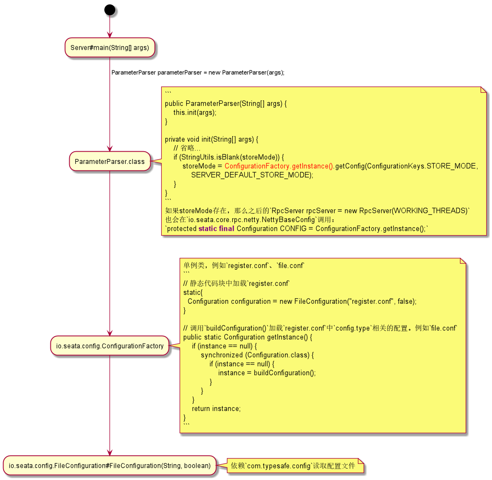
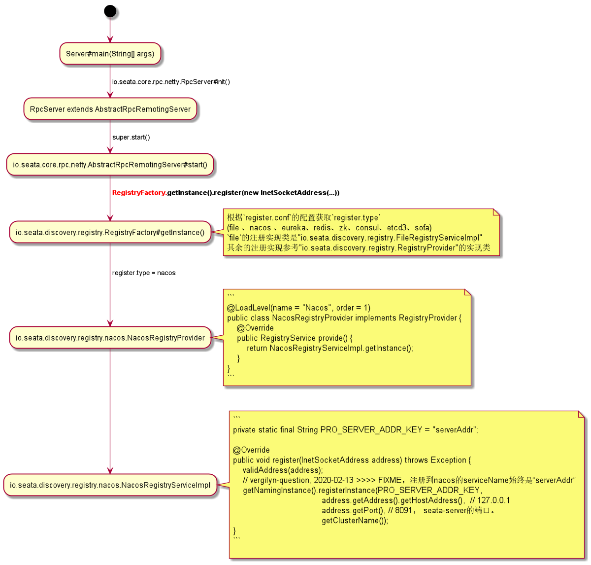

# 【001】seata-server配置文件的加载过程

+ [github, seata]
+ [vergilyn seata-fork]
+ [seata.io zh-cn docs]

## 1. 相关知识
1. netty

2. netty多线程模型：Reactor模型

3. protobuf(Google Protocol Buffers)
> 在以不同语言编写并在不同平台上运行的应用程序之间交换数据时，Protobuf 编码可提高效率。

个人也没有去大致了解过，只是因为启动seata-server时报错才看到的。

参考：
+ [github, protobuf]
- [深入 ProtoBuf - 简介](https://www.jianshu.com/p/a24c88c0526a)

4. "com.typesafe.config"
> configuration library for JVM languages using HOCON files

例如seata中主要的2个配置文件`register.conf`和`file.conf`，底层都是依赖"com.typesafe.config"读取并解析其配置。

参考：
+ [github, com.typesafe.config]

## 2. protobuf(Google Protocol Buffers)
启动seata-server时遇到的问题：
```
E:\Workspace Git\seata-fork\codec\seata-codec-protobuf\src\main\java\io\seata\codec\protobuf\convertor\BranchCommitRequestConvertor.java
Error:(19, 41) java: 程序包io.seata.codec.protobuf.generated不存在
```

通过查找protobuf的资料...BALABALABALA...

### 2.1 protobuf 本地安装
下载地址：[github, protobuf-release]

<font color="red">特别：通过maven-plugin来编译proto文件，**可能**不需要这么安装protobuf。(ps. 搞懵逼了，i'm five~~)</font>

注意windows下载的是`protoc-3.11.3-win64.zip`，而不是`protobuf-java-3.11.3.zip`（这个需要自己编译）。

下载并解压后，将`bin`目录添加到`环境变量 - 系统变量 - path`。通过cmd验证是否安装成功：
```
PS C:\Users\Administrator> protoc --version
libprotoc 3.11.3
```

### 2.2  protobuf-maven-plugin
1. idea安装插件`Protobuf Support`（proto语法高亮，mvn编译命令）
- [idea使用Protobuf插件](https://www.cnblogs.com/TechSnail/p/7793813.html)

2. maven-plugin 配置，例如seata源码中的相应 [seata/pom.xml](../../pom.xml)
```XML
<plugin>
    <groupId>org.xolstice.maven.plugins</groupId>
    <artifactId>protobuf-maven-plugin</artifactId>
    <version>${protobuf-maven-plugin.version}</version>
    <configuration>
        <protoSourceRoot>${project.basedir}/src/main/resources/protobuf/io/seata/protocol/transcation/</protoSourceRoot>
        <protocArtifact>
            com.google.protobuf:protoc:3.3.0:exe:${os.detected.classifier}
        </protocArtifact>
    </configuration>
    <executions>
        <execution>
            <goals>
                <goal>compile</goal>
            </goals>
        </execution>
    </executions>
</plugin>
```

3. 手动编译，idea中`Maven - {seata-codec-protobuf 1.0.0} - plugins - protobuf - [protobuf:compile | protobuf:compile-javanano]`。
关于`protobuf:compile`或者`protobuf:compile-javanano`并不清楚其具体的含义。  
大致的表面现象是，最终生成的代码在`target/generated-sources`下目录不一样。

到此，IDEA中查看例如"io.seata.codec.protobuf.convertor.BranchCommitRequestConvertor"不在报错。

### 2.3 扩展，protobuf生成代码缺少"com.google.protobuf.nano.*"
为了解决这个问题，我在[codec/seata-codec-protobuf/pom.xml](../../codec/seata-codec-protobuf/pom.xml)中增加了其MAVEN依赖：
```xml
<!-- vergilyn-comment, 2020-02-13 >>>> 添加 -->
<dependency>
    <groupId>com.google.protobuf.nano</groupId>
    <artifactId>protobuf-javanano</artifactId>
    <version>3.1.0</version>
</dependency>
```

## 3. 配置文件的读取（register.conf、file.conf）


## 4. 将seata-server注册到服务注册中心（例如eureka、nacos）


#### 4.1 备注
1. seata v1.0.0中，通过nacos获取conf并不支持指定GROUP，默认从`SEATA_GROUP`获取（在下一个版本开始支持配置GROUP）。
```JAVA
package io.seata.config.nacos;

public class NacosConfiguration extends AbstractConfiguration {

    private static final String SEATA_GROUP = "SEATA_GROUP";

    @Override
    public String getConfig(String dataId, String defaultValue, long timeoutMills) {
        String value;
        if ((value = getConfigFromSysPro(dataId)) != null) {
            return value;
        }
        try {
            value = configService.getConfig(dataId, SEATA_GROUP, timeoutMills);
        } catch (NacosException exx) {
            LOGGER.error(exx.getErrMsg());
        }
        return value == null ? defaultValue : value;
    }
}
```


2. question: 现在seata支持的nacos的配置是一项一项的（nacos的dataId过多）
+ [SEATA issues#2011](https://github.com/seata/seata/issues/2011)

```
store {
  ## store mode: file、db
  mode = "db"

  ## database store property
  db {
    datasource = "druid"
    db-type = "mysql"
    driver-class-name = "com.mysql.jdbc.Driver"
    url = "jdbc:mysql://127.0.0.1:3306/test_microservice"
    user = "root"
    password = "123456"
  }
}

对应的是7个data-id，而不是一个data-id中的key-value：
1. store.mode
2. store.db.datasource
3. store.db.db-type
4. ...
```

3. seata注册到nacos的服务名默认叫“serverAddr”
+ [SEATA issues#1277](https://github.com/seata/seata/issues/1277)

相关代码参考：[io.seata.discovery.registry.nacos.NacosRegistryServiceImpl#register(...)](/discovery/seata-discovery-nacos/src/main/java/io/seata/discovery/registry/nacos/NacosRegistryServiceImpl.java)
```java
package io.seata.discovery.registry.nacos;
public class NacosRegistryServiceImpl implements RegistryService<EventListener> {
    private static final String PRO_SERVER_ADDR_KEY = "serverAddr";

    @Override
    public void register(InetSocketAddress address) throws Exception {
        validAddress(address);
        // vergilyn-question, 2020-02-13 >>>> FIXME，注册到nacos的serviceName始终是“serverAddr”
        getNamingInstance().registerInstance(PRO_SERVER_ADDR_KEY, address.getAddress().getHostAddress(), address.getPort(), getClusterName());
    }
}
```

## 5. 总结
1. seata配置的加载
seata配置加载类（factory模式）：`io.seata.config.ConfigurationFactory`  
不同`config.type`对应的加载扩展：`io.seata.config.ConfigurationProvide`

2. `register.conf`
其中只有2个配置：
a)`register.type`，将seata-server注册到什么地方。
b)`confi.type`，seata-server的一些核心配置。例如"store.mode"，seata-server如何记录transaction log。

3. seata-server注册到什么地方
`io.seata.discovery.registry.RegistryFactory` 注册类（factory模式）  
根据从`register.conf`中配置的不同`register.type`，调用相应`io.seata.discovery.registry.RegistryProvider`的实现类。


[seata.io zh-cn docs]: https://seata.io/zh-cn/docs/overview/what-is-seata.html
[github, seata]: https://github.com/seata/seata
[vergilyn seata-fork]: https://github.com/vergilyn/seata-fork

[github, protobuf]: https://github.com/protocolbuffers/protobuf
[github, protobuf-release]: https://github.com/protocolbuffers/protobuf/releases

[github, com.typesafe.config]: https://github.com/lightbend/config
